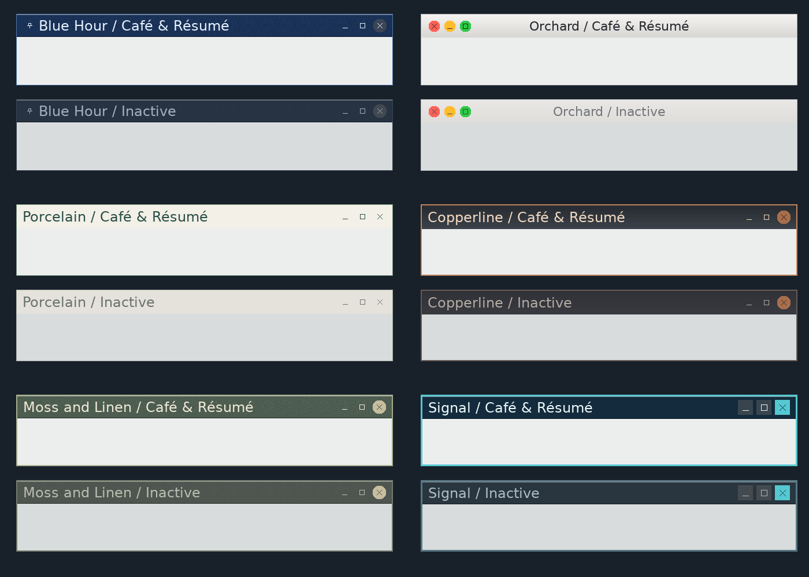

# Included Frame Studio compositions

The OS ships prepared, self-contained `.frame` files from the repository's
`frames/` directory into `/etc/frames` on both the ext2 root and FAT lifeboat.
The directory contains composition files so it can be served as one os64get
lot: append `frames=frames` to the server command and route `@frames` to
`/etc/frames` in the P5's effective `os64get.conf`.

Frame Studio combines that collection with the personal collection selected
by `os64_conf_target("frames")`, normally `/home/frames`. A personal entry
shadows an included entry of the same name. Included entries are identified
in the browser and cannot be deleted there. Save writes a personal copy;
deleting that copy reveals the included original again. Loading, preview,
Apply and startup snapshots use the same validation for either source.
Neither installing the collection nor browsing it applies a composition.

The first collection:



- **Blue-Hour:** the promised deep blue grain, pale text and blue focus edge;
  a pin on the left, with the ordinary controls on the right.
- **Orchard:** our macOS-inspired composition: a quiet silver titlebar,
  centered dark title, and red/yellow/green circles with dark symbols on the
  left. It uses os64's existing close/minimize/maximize actions.
- **Porcelain:** warm ivory, restrained green accents and simple controls.
- **Copperline:** charcoal and copper, with generous, readable typography.
- **Moss-and-Linen:** muted olive and linen with a fine-grained finish.
- **Signal:** crisp navy and cyan, square controls and a stronger border.

Filenames use hyphens because the os64serve catalogue separates fields with
spaces. Each composition embeds its font metrics, glyphs and finish tiles.
The editable font reference uses the shipped DejaVu face under `/etc/fonts`.
The DejaVu license already travels with the OS under `/etc/licenses`.

The host generator uses the pinned production FreeType port, decoration
preparation, container encoder and painter. Generated files are checked in so
normal OS builds and Windows os64serve do not need to run a host compiler.
Regenerate with `python3 tools/generate_frame_collection.py`; verify with
`python3 tools/generate_frame_collection.py --check --sanitize`. The optional
`--preview FILE.ppm` writes active/inactive samples using the production painter.

## P5 update

Chris's Windows command, with the included collection appended:

```bat
python3.exe "%W%\tools\os64serve.py" "%W%\userland\bin" "%W%\userland\bin\tests=tests" "%W%\userland\bin\pages=pages" "%W%\kernel\bin=kernelbin" "%W%\etc" "\\wsl$\Ubuntu-big2\home\yogi\src\os64\etc\fonts=fonts" "%W%\frames=frames"
```

Add `@frames = /etc/frames` to the effective P5 routing file before the first
bulk download. If `/home/os64get.conf` exists, it overrides the shipped
`/etc/os64get.conf`; add the rule there. With the system file in use, fetch
the updated `os64get.conf` separately first, then perform the ordinary bulk
refresh. The running downloader reads its routing before installing the new
configuration, so adding both in one first-time bulk refresh is insufficient.

Load the new files from Frame Studio's Saved tab after updating the app.
Included files carry an `(included)` label; Save creates a personal copy.

Validation and guest screenshots are recorded in the
[collection checkpoint](docs/frame-studio/collection-checkpoint.md).
