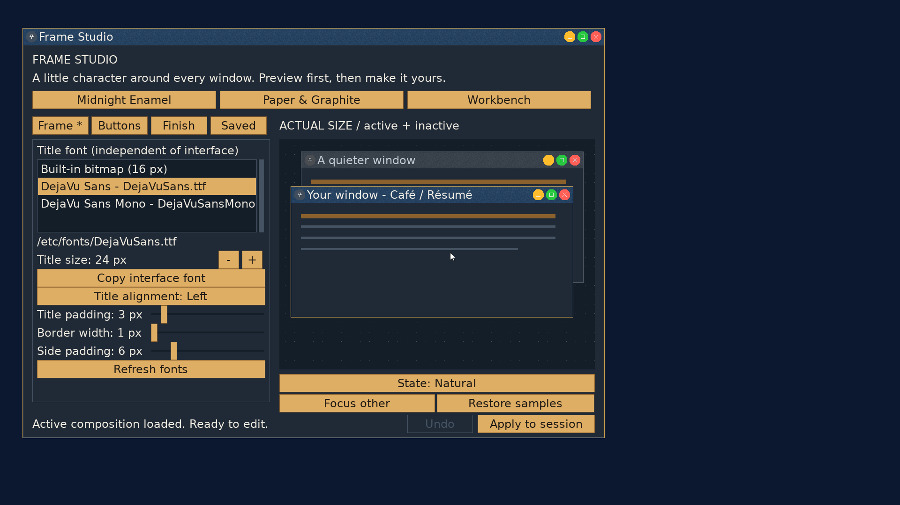

# Frame Studio: open the active saved composition

2026-09-23, `codex/frame-studio`, on `userland` base `be2d755`.

Studio opens the first name-sorted saved composition whose prepared bundle
matches the live fingerprint and byte length. It restores the saved name,
selection and clean baseline, using embedded font assets rather than preparing
from source files. Opening does not Apply or change the startup choice.

The kernel extends `/sys/decorations` status with a versioned FNV-1a-64 hash
and byte length. It computes the hash on validated private staging outside the
GUI lock; successful publication installs the identifier with the generation.
Status reads retain the existing immutable per-open snapshot behavior.
Generation-only readers still work, and the new status reader accepts old
kernels as having no fingerprint. See `FRAME_STUDIO.md` for the text format,
byte-based matching semantics and non-cryptographic identifier limitations.

A second status read checks the candidate against the same live generation.
Studio retains that generation for its later Apply comparison. Failed matching
leaves outputs intact and frees candidate assets. Unreadable or corrupt files
are skipped. No fingerprint or no saved match retains the normal initial draft.
The existing collection bounds (128 entries, 512 directory entries scanned)
remain in force; lookup holds one decoded candidate at a time.

## Verification

- Strict userland/kernel/ISO build passed. The [ASan/UBSan suite](active/host.txt)
  passed FNV vectors, status framing/bounds/truncation, legacy status, V4/V5
  saved bundles, missing font sources, sorted duplicate matches, damaged/missing
  files, mismatching length/hash, read refusal, and a racing generation change.
  Existing saving, startup, deletion and rendering tests also passed.
- QEMU at 1920x1080 with 24px interface text initially retained the normal draft
  with no installed composition. Loaded **Traffic lights**, selected Use at
  startup, applied, closed and reopened Studio. The [reopen log](active/reopen.txt)
  and [Saved page](active/reopen.png) show the matching name and clean draft.
  The live [before](active/before.txt) and [after](active/after.txt) status files
  are byte-identical: generation one and the same fingerprint.
- Cold boot installed that startup snapshot. Studio automatically
  [loaded the same saved entry](active/boot.txt), showed the active composition
  message, and closed without an unsaved prompt. The [boot status](active/boot-status.txt)
  remains generation one with the same identifier.
- The extended [real-WM fixture](active/kernel.txt) passed publication,
  stale-generation rejection, shared-handle staging, concurrent publishers,
  geometry refusal, and fingerprint preservation on refused commits.
- After the fixture installed a decoration absent from the collection, Studio
  retained its [normal draft](active/unmatched.png). The [opening log](active/unmatched.txt)
  contains no saved match, and the before/after status files remained identical.
- Tracked and untracked source whitespace checks passed. `tools/stale_refs.sh`
  reported only the existing `NO_DECORATIONS` shorthand in GRAPHICS.md and gui.h;
  those refer to the live GUI flag.

This is host and QEMU evidence; P5 validation is left to the user. Installing the
new kernel and rebooting enables fingerprint status. An older running kernel
keeps the previous opening behavior. The private QEMU data and normal boot
configuration were restored after testing.
