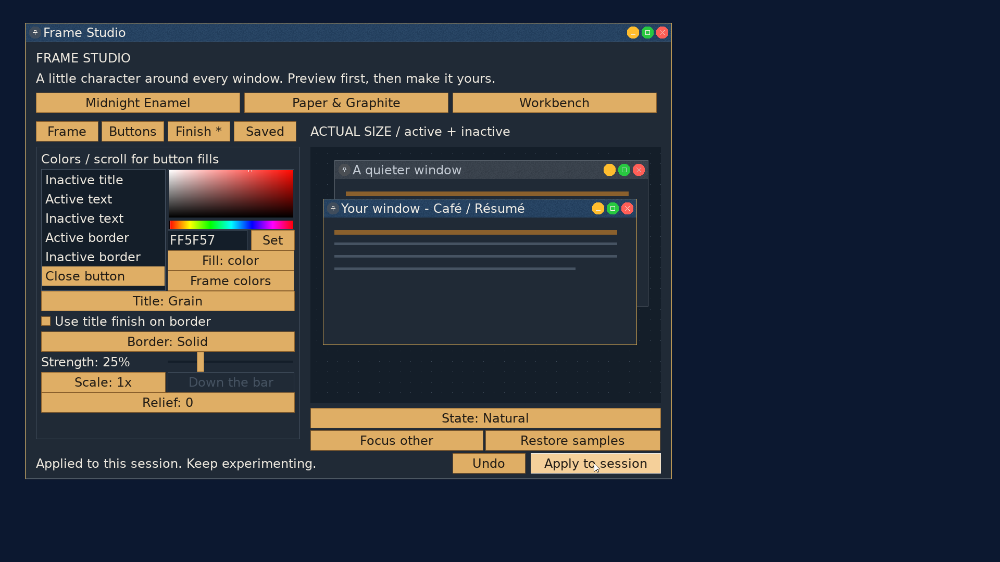
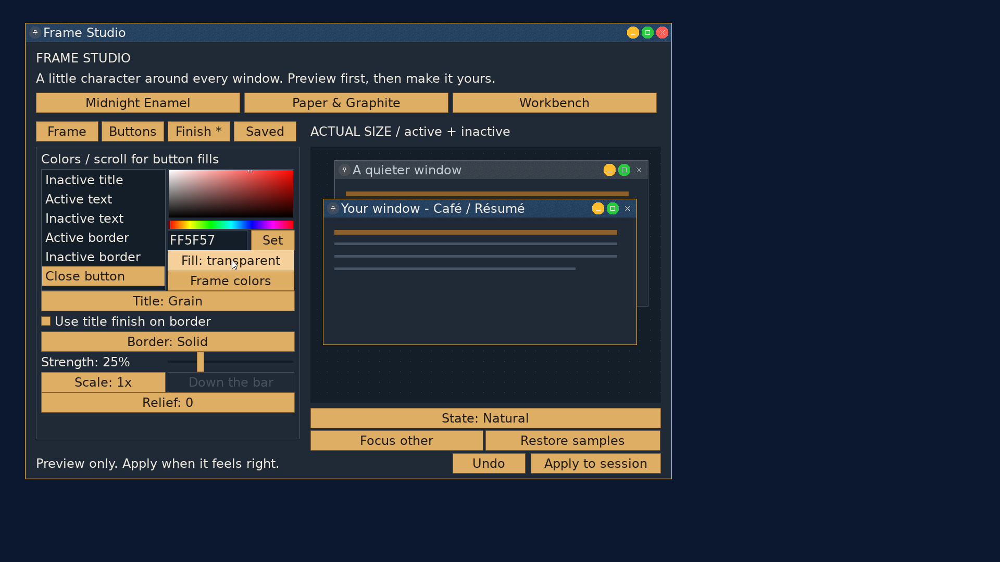
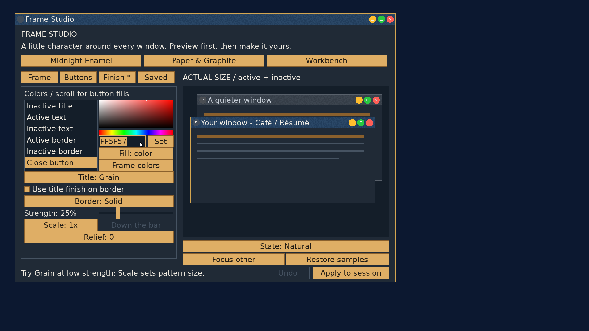
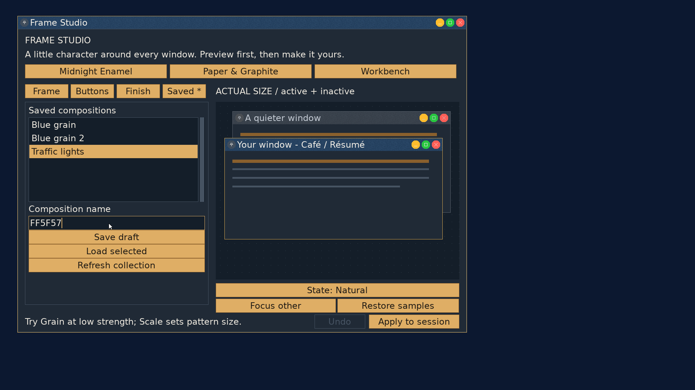

# Frame Studio: selectable codes and button fills

Implemented in the `codex/frame-studio` worktree; not committed or published.

Textfields support drag selection, Shift+motion and Ctrl+A/C/X/V. Selections
use the text run's cluster geometry. Failed cut/paste leaves the field intact.
Frame Studio avoids resetting an unchanged hex field during control refresh.

Each control can use Automatic, Color or Transparent fill. Buttons -> select a
slot -> Edit button color opens its Finish color entry. Selecting Color for a
Bare button also selects Round, making the fill visible. Transparent leaves
texture and hit geometry intact. Colors use the shared preview/WM painter and
participate in Undo, Apply and Save. V5 reuses the V4 button reserved word;
V4 saves retain automatic fills and load without their original font sources.

## Validation

- Strict full userland/kernel/ISO build passed. Normal Limine configuration
  restored after testing; the isolated test VM was stopped.
- ASan/UBSan real-font UI suite: 1,430 checks, zero failures. Includes full and
  partial selection, UTF-8 cluster copying, failed cut/read, selected replacement,
  drag geometry, highlight pixels and collapsing selection with Left.
- Scribe regression suite: 2,470 checks, zero failures.
- Decoration/storage ASan/UBSan tests passed: custom/inactive colors, transparent
  interaction states and hit testing, split damage, V4 load/restyle, V5 save/load,
  existing storage refusal and allocation checks.
- QEMU 1920x1080 with 24 px interface/title font: Ctrl+A/C selected and copied
  `203B59`; guest shell read the same bytes from `/sys/clipboard`. Mouse-drag
  selected `FF5F57`; Ctrl+C then Ctrl+V pasted it into the composition name field.
- QEMU: yellow minimize, green maximize and red close, round housings, Apply to
  the live titlebar, transparent close in preview, Undo, Save and Load passed.
  Existing V4 `Blue grain` loaded with its embedded 30 px font; new V5 `Traffic
  lights` loaded with its three exact stored colors (see saved-fields.txt).
- `git diff --check` passed. `tools/stale_refs.sh` reported the existing
  `NO_DECORATIONS` prose shorthand; the corresponding GUI flag is still live.

New behavior was tested in QEMU, not directly on the P5.

## Evidence

Logs and old/new load screenshots are in [button-fills](button-fills/).
