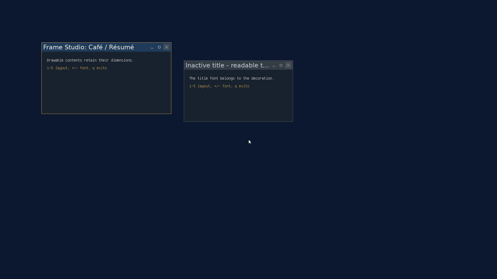

# Frame Studio: standard controls

2026-09-22, `codex/frame-studio`, following the typography checkpoint.
This records stage 2; [the native editor checkpoint](editor-checkpoint.md)
extends it with the finish format and Control Center application.

The prepared decoration now includes optional close, minimize,
maximize/restore and pin buttons. Leading/trailing groups, order, spacers,
square/round/bare housings, button size and spacing are composition data.
The kernel and userland compile the same geometry, painter and capture logic.
The native Frame Studio editor and its Control Center entry are stage 3.



Other live examples: [close-only](controls/close-only.png),
[reversed leading group](controls/reversed.png), and
[optional pin](controls/pinned.png). These are integration fixtures, not editor
mockups. Inactive titles truncate before the button group. Pin and Restore have
distinct toggled symbols; unavailable actions are dimmed.

## Try it in a snapshot

From a terminal in the GUI, run:

```sh
/tests/decorationtest --hold
```

It runs publication/geometry checks, applies its font and controls to the
session, and leaves two windows open. Focus either window and use:

| Key | Effect |
| --- | --- |
| `1` | Standard trailing minimize/maximize/close |
| `2` | Round close button alone |
| `3` | Leading close/maximize/minimize |
| `4` | Empty control groups |
| `5` | Standard trailing group plus leading pin |
| `+` / `-` | Increase/decrease title font size |
| `q` | Exit the fixture |
| `l` / `r` | Fix the content minimum at its current size / release it |
| `v` | Log geometry, client mouse-edge counts and close requests |
| `d` | Replace the first window, for destruction during capture |

Close deliberately logs a request and leaves these test windows open; use `q`
to exit. Ordinary applications receive their normal close event. The applied
style survives fixture exit but is not restored after reboot.

## Implementation and limits

The bundle version is 2, with a 240-byte header and up to eight slots.
Actions cannot repeat; spacers can. Unused slots must be zero. Buttons are
16..48 pixels and gaps 0..16. The line box accommodates both buttons and text.
The layout reserves the groups and a 24-pixel drag interval before truncating
text. Round housings retain rectangular slot hit extents.

Apply preflights ordinary, maximized and saved restore rectangles against the
decoration minimum without silently growing application content. Creation
rejects a frame that cannot fit; interactive resizing clamps to the minimum.
Maximize and Restore decline when their target violates application or
decoration limits, and their button reflects that availability.

A button press captures window identity and action. Release over the same
button activates it; drag-out and re-entry change the pressed state. Apply,
geometry replacement, destruction, minimize and VT handoff cancel activation
while retaining consumed mouse edges through their releases. Button clicks
reset titlebar double-click tracking. Close requests do not arm the Alt+F4
force-close timer. Keyboard and pointer actions share the WM action helpers;
the deliberate Alt+F4 escalation stays in the keyboard path.

## Validation

- Strict kernel, userland and full ISO builds passed.
- `ASAN_OPTIONS=detect_leaks=0 tools/test_decoration_host.sh` passed validation,
  group/minimum geometry, spacer and empty hits, press/re-entry/cancellation,
  additional-button draining, and split-damage equality for square, round and
  bare controls in hover, pressed, inactive, unavailable and restored states.
  The typography preparation, F2 pixel parity and allocation checks also pass.
- In the 1920x1080 QEMU fixture, malformed/stale/abandoned and concurrent
  publication checks passed. A narrow close-only window made a wider standard
  composition refuse Apply without advancing the generation.
- The [guest interaction log](controls/guest.txt) recorded four normal close
  requests, including two rapid clicks, and zero client button-down or
  button-up events throughout the control tests. Release outside cancelled;
  re-entry activated. Apply, VT switch, destruction and minimize during a
  press cancelled without leaking a release. A second held mouse button was
  drained after the left-button action completed.
- Clicking the reversed-layout buttons maximized to 1920x1080, restored to
  500x240 content, and minimized; Alt+Tab restored the window. Pin changed the
  reported flag from 256 to 260. The fixture [exited zero](controls/exit.txt).

The first disabled-Restore attempt used a large HMP relative mouse movement.
The screenshot showed the pointer at x=1250 while the script expected x=1873;
remaining queued motion arrived after the press and dragged the titlebar.
The last moved-frame entries in `controls/guest.txt` record that test-driver
artifact. A repeat uses bounded movement steps and checks the actual pointer
position before pressing; its separate evidence is recorded below.

The [controlled repeat](controls/restore.txt) passed: the cursor hotspot was
verified at (1873,18), over Restore. Clicking it with the maximized content
minimum locked retained frame (0,0), 1920x1080, flags 264. Releasing that minimum
and clicking again restored frame (160,164), 502x277, content 500x240, flags 256.
Client edge counts stayed zero and the [exit status](controls/restore-exit.txt)
was zero. See [disabled Restore](controls/disabled-restore.png) and
[the restored window](controls/restored.png). No code change was needed for
this repeat.

`git diff --check` and whitespace checks on the new text files passed.
`tools/stale_refs.sh` reported the existing `NO_DECORATIONS` shorthand in
prose; the corresponding flags remain live. The added control code was also
checked for the tool's superlative-comment patterns, with no matches.

The worktree's test ISO temporarily selected GUI boot at 1920x1080. Boot config
is restored after testing. The tracked TCP-monitor `vmboot` helper waits for a
serial marker absent from this GUI boot; screenshots and guest results verify
execution despite that timeout. Tests use private disks on port 55558 and stop
their VMs afterward.

No independent review or physical-machine validation has been performed.
The next stage is the native editor, preview, accessible composition controls
and built-in finishes described in [FRAME_STUDIO.md](../../FRAME_STUDIO.md).
