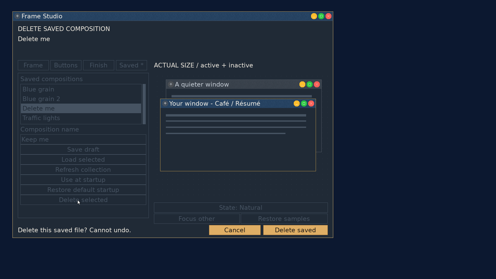

# Frame Studio: delete saved compositions

2026-09-23, `codex/frame-studio`, on `userland` base `be2d755`.
**Saved → Delete selected** removes the selected collection entry after a
confirmation naming it. The editable Save name does not choose the deletion
target. With no selection, Delete is disabled.

The confirmation locks the editor's other controls, offers Cancel and Delete
saved, and says the operation cannot be undone. Long names use two full-width
rows, keeping the target out of the short footer. Removal does not decode the
file, so damaged compositions can be deleted. The storage helper shares the
Save/Load name validation and collection path construction; directory entries
are refused because os64's unlink also accepts empty directories.

Cancellation and failure preserve the selection, draft and saved-baseline state.
Success refreshes the collection without changing the loaded assets, Undo
history, live decoration or independent startup snapshot. The last successfully
saved/loaded name is tracked separately from both the list selection and the
editable name. Removing that baseline marks the retained draft unsaved; Undo
cannot clear the deletion flag. A successful Save or Load establishes a new
baseline. Closing an unsaved retained draft asks before discarding it.

## Verification

- Strict userland/kernel/ISO builds and the [sanitized decoration suite](deletion/host.txt)
  passed. Host cases cover invalid/path-traversal names, unlink refusal,
  missing files, exact collection removal, corrupt files, directory refusal,
  retained loaded assets, startup snapshot survival and unchanged session state.
- QEMU used 1920x1080 and 24px interface text. A disposable **Delete me**
  composition was saved, chosen for startup, and applied at generation one.
  The Save name was then changed to **Keep me**: the confirmation still named
  **Delete me**. [Cancel](deletion/cancel.png) retained the entry;
  [confirmation](deletion/draft-kept.png) removed it and marked the draft unsaved.
- The [preview and live titlebar pixels](deletion/pixels.txt) were unchanged by
  deletion. The [removed path](deletion/deleted-file.txt) was absent. Extracted
  startup and rescued composition files [matched the original assets](deletion/preservation.txt)
  byte for byte; the startup envelope's length and checksum were valid.
- After a preset change and [Undo](deletion/undo-unsaved.png), closing still
  showed the [unsaved-draft warning](deletion/close-warning.png). Saving the
  retained draft as [Keep me](deletion/rescued.png) restored a clean baseline.
- A [40-character name](deletion/long-name.png) appeared in full across the two
  confirmation rows. This deletion was cancelled.
- Temporarily moving a selected **Broken** file away before confirmation
  produced [failure without changing the draft or selection](deletion/failed.png).
  Restoring its damaged contents then allowed [deletion without loading](deletion/corrupt.png).
  This was not the draft's baseline, so the saved draft remained clean and
  [closed without a discard prompt](deletion/clean-close.png).
- The [guest log](deletion/guest.txt) records both successful deletions, their
  different dirty states, the rescue save, and clean exit. The live decoration
  stayed at [generation one](deletion/generation.txt).
- `git diff --check` passed, including explicit checks of the untracked sources.
  `stale_refs.sh` reported the existing `NO_DECORATIONS` shorthand in GRAPHICS.md
  and gui.h; the corresponding flag remains live. No new superlative claims.

The private test data and normal Limine configuration were restored, the normal
ISO rebuilt, and the test VM stopped. No P5 or independent review validation has
been performed for this slice. Work remains uncommitted. Appearance Workshop
collection deletion is separate; independent button-symbol colors are next.
