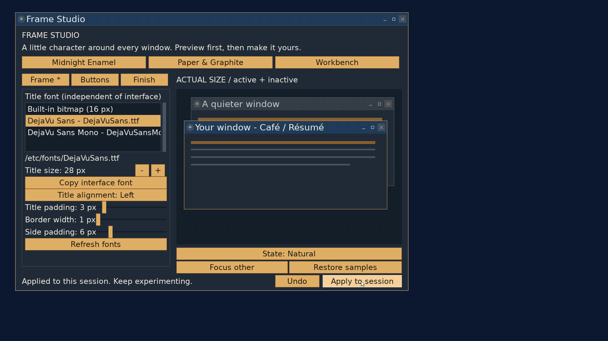
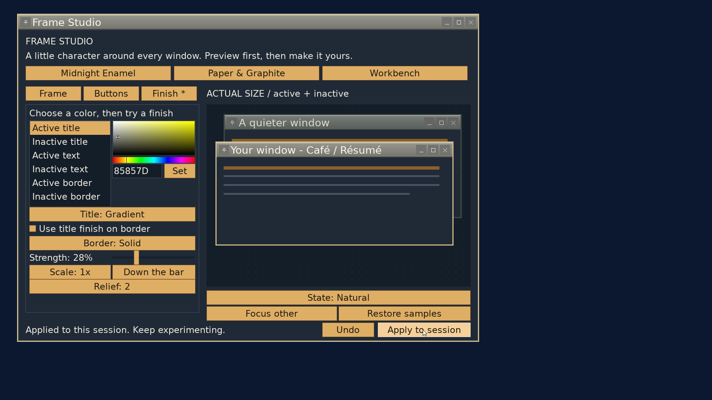

# Frame Studio: native editor

2026-09-22, `codex/frame-studio`, following the typography and controls
checkpoints. The application is available through **Control Center -> Frame
Studio**, beside Appearance Workshop, or by running `/bin/framestudio`.
The [two-color extension](two-colors-checkpoint.md) records the color-pair
controls and their validation.
The [saving checkpoint](saving-checkpoint.md) records named compositions and
their independent prepared-asset lifetime.

This stage provides a native editor, actual-size active/inactive previews,
draft Undo, built-in finishes, explicit Apply to session and named Save/Load.
Startup selection and imported images remain for later work.
Closing the editor retains an applied decoration; rebooting does not apply it
automatically. Saved files survive reboot and can be loaded and applied again.
Reopening the editor starts a fresh Midnight Enamel draft, rather than loading
the session's recipe.

## Using the editor

- **Frame:** choose a title face and size, alignment, title/side padding and
  border width. Typography starts as a copy of the effective interface font;
  subsequent title edits do not change the editor's interface font. Copy
  interface font is an explicit action. The built-in bitmap face stays at 16px;
  scalable faces have size buttons bounded at 8 and 64px.
- **Buttons:** include or remove close, minimize, maximize/restore and pin.
  Select a slot, then use Earlier/Later, Group and Shape to arrange it. Spacers
  can repeat; actions cannot. Close-only and empty compositions are valid.
  These are ordinary keyboard-accessible controls; drag rearrangement is not
  implemented.
- **Finish:** choose an active/inactive title, text or border role, then edit
  Color 1 or Color 2 with the picker or RGB hexadecimal field. Text uses one
  color. Solid disables Color 2 but preserves its value. Choose Solid, Gradient,
  Grain, Stripes or Stipple; adjust strength, scale, direction and relief. The border can use its
  own finish or share the title's finish with its own color pair.
- **Saved:** name and save the current draft, or load a selected composition
  into preview. Save does not Apply. Replacing an existing name asks for
  confirmation; loading over unsaved edits asks before discarding them.

Midnight Enamel starts with the pin on the left. Paper & Graphite demonstrates
fine stripes and bare controls. Workbench uses warm gray, square controls and
a raised edge. Choosing a preset replaces the frame recipe while retaining
the chosen title font.

The two samples use the same painter and geometry as actual windows. Their
buttons are interactive: close/minimize hides a sample, maximize changes its
preview rectangle, and pin toggles its symbol. **Restore samples** brings
them back using the mouse. Focus other and the state selector show the active,
inactive, hover, pressed and unavailable treatments. Preview actions do not
manage the editor window.

Undo holds up to 32 prepared draft snapshots within 32 MiB and coalesces slider/picker gestures.
Failed preparation and no-op edits do not consume a snapshot. Apply publishes
the prepared draft against the session generation; a competing publisher
requires reviewing the draft and trying again. Closing with unsaved changes
offers Keep editing or Discard & close, including for
edits already applied to the session. Draft edits never publish implicitly.
Load clears Undo after confirming any unsaved draft. Embedded lettering lets
saved looks load and restyle without their original font files; changing the
font or size needs an available source. Font changes can be undone using the
retained prepared snapshot.

## Your first texture

No image file is needed for the built-in finishes:

1. Choose **Midnight Enamel**, then open **Finish**.
2. Select **Active title**, choose a dark blue for **Color 1**, and set
   **Title: Grain**. Select **Color 2** and choose a lighter blue.
3. Keep **Strength** near 10-15% and **Scale: 1x** for fine texture. Try 2x to
   see a coarser pattern. Undo gets you back if the result becomes distracting.
4. Choose **Inactive title** and make it quieter so focus remains obvious.
5. Leave the border solid for a clean edge, or enable **Use title finish on
   border** to continue the texture around the window.
6. Check both sample titles at actual size, then **Apply to session**.

Strength softens the pattern's second color toward the first; at 100%, the
full pair is used. Scale controls the repeating pattern's cell size. Direction
affects gradients and stripes; grain and stipple do not have an orientation. Gradient spans its
surface instead of repeating and reaches both exact chosen endpoints.
Strength and Scale are disabled unless a title or border uses a pattern;
they have no effect on gradients. Sharing the title finish on a border keeps
the border's own two colors.
Imported textures and a repeatable external-image workflow belong to the
later persistence stage.

## Implementation and validation

The prepared bundle is version 4 with a 296-byte header. Four opaque 32x32
tiles follow the aligned glyph masks: active/inactive title, then
active/inactive border. Userland generates them; the shared allocation-free
painter samples them. Style edits retain prepared glyphs and regenerate tiles.
Fonts, masks and tiles remain bounded and pointer-free at publication. Earlier
bundle versions are refused; saved container V1 embeds the current bundle.

The initial editor content is 1240x840, fitted to the display. The interface
font planner increases control spacing and minimum size as needed; a font
that cannot fit is refused while keeping the editor usable. Preview is at
actual size; when a draft cannot fit the sample width, the label reports
clipping and suggests enlarging the window.

- Strict userland, kernel and full ISO builds passed.
- The [sanitized host suite](editor/host.txt) passed control geometry/capture,
  lifetime and allocation refusal, font pixel parity, all five finishes in
  both directions, split-damage equivalence, frame-relative translation,
  deterministic preparation, glyph-preserving restyle, invalid format/alpha
  refusal, and preset font preservation.
- QEMU ran at 1920x1080 with a 24px DejaVu Sans interface. Live Apply changed
  title typography independently to 28px; Undo returned it to 26px. Applied
  layouts included [close-only](editor/close-only.png), a
  [round leading close](editor/leading-close.png), and pin-left standard
  controls. Closing a [sample](editor/sample-hidden.png) left the app running;
  Restore samples brought it back.
- Workbench applied its gradient and relief to the editor's actual frame.
  The picker, match-border option, scale and direction changed the preview,
  and Apply installed the result. After discarding a different unapplied
  preset and exiting, a [new Control Center window](editor/inherited.png)
  inherited the previously applied custom finish. The
  [interaction log](editor/guest.txt) records seven successful publications
  and a [zero exit status](editor/exit.txt).
- The final visual pass confirmed the expanded six-color list and readable
  footer controls. Space activated the focused font-size button and
  match-border checkbox. Enter submitted a [hex color](editor/hex.png) into
  the preview. [Keep editing](editor/confirm.png) retained an unapplied draft;
  Undo [returned it to the last Apply](editor/kept.png), and closing then
  exited normally. The [final log](editor/final-guest.txt) records three
  publications with independent 28px titles and a
  [zero exit status](editor/final-exit.txt).

`git diff --check` and whitespace checks on new text files passed.
`tools/stale_refs.sh` reports the existing `NO_DECORATIONS` shorthand; the
corresponding flags remain live. New comments were read alongside their code.

Testing used private VM disks on port 55558. The tracked `vmboot` helper waits
for a serial marker absent from this GUI boot; screenshots and guest results
establish execution despite that helper timeout. Test boot configuration was
restored and the test VMs stopped afterward.

No independent review or physical-machine validation has been performed.
The broader product contract and remaining stages are in
[FRAME_STUDIO.md](../../FRAME_STUDIO.md).
