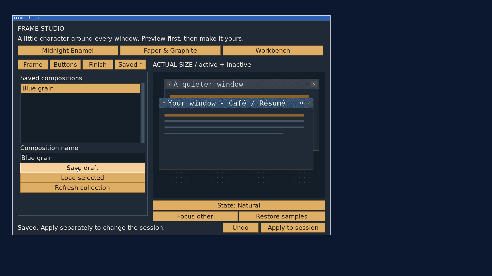

# Frame Studio: named compositions

2026-09-22, `codex/frame-studio`. **Saved** adds named Save/Load to the native
editor. It follows the container and publication contract in
[FRAME_STUDIO.md](../../FRAME_STUDIO.md#publication-saving-and-startup).

Choose **Saved**, enter a composition name, and click **Save draft**. To bring
one back, select its name and click **Load selected**. Save captures the draft
without publishing it. Load replaces the preview; **Apply to session** remains
an explicit separate action. Existing names require replacement confirmation,
and loading over unsaved changes asks before discarding them.

Names use 1..40 letters, digits, interior spaces, `-`, `_`, `&`, `(` or `)`.
Files are stored in the config target's `frames` directory, normally
`/home/frames`, with a `.frame` extension. Refresh collection finds files added
outside the editor. The browser reports a limit rather than silently truncating
more than 128 compositions or a directory scan beyond 512 entries.

A saved file contains the composition, its chosen title-font paths and size,
and prepared glyphs, pair adjustments and finish tiles. Loading and restyling
therefore do not need the original font file. Changing font or size does need
an available source. Undo retains prepared snapshots, so a font change can
be undone even when the previous source is absent. Load starts a fresh Undo
history. The history is bounded by 32 entries and 32 MiB.

The close prompt now checks unsaved changes, including changes already applied
to the session. A saved or freshly loaded draft can close without that prompt.
Startup selection is separate future work: saved files survive reboot, but
loading/applying them after boot remains explicit. Imported image textures and
rounded silhouettes are outside this addition.

## Storage contract

Container V1 has an 800-byte little-endian header followed by a validated V4
prepared bundle. The total cap is 8 MiB plus the header. Length, version,
reserved fields, font metadata, embedded assets and an FNV-1a checksum are
checked before replacing the draft. The checksum detects corruption and is
not an authenticity mechanism. Prepared resource offsets are removed when
recovering the editable recipe.

Save validates the recipe and bundle before writing, creates a new exclusive
staging file in the same directory, handles short/interrupted writes, requires
successful sync, then publishes with NOREPLACE. Confirmed replacement uses
REQUIRE_ATOMIC_REPLACE; a filesystem unable to replace safely refuses without
unlinking the old composition. Failure removes owned staging and leaves the
previous file and draft intact. A successful sync/rename is the acknowledgement;
close is not used to infer persistence success.

## Validation

- Strict userland, kernel and full ISO builds passed.
- The [sanitized host suite](saving/host.txt) passed embedded-asset round trips,
  bounded/checksummed decoding, invalid names, short reads/writes, allocation
  failure, corrupt/truncated files, partial write/read failure, sync refusal,
  rename refusal, no-replace preservation, explicit replacement and sorted
  collection limits. Existing font, finish, geometry and capture checks passed.
- QEMU at 1920x1080 with 24px interface text saved **Blue grain** using a
  disposable `/home/fonts/Studio.ttf`. [Save](saving/saved.png) kept generation
  zero; Apply then installed its 28px title. The replacement dialog was
  cancelled, Load confirmed discarding another draft, and a subsequent
  confirmed replacement saved a 30px title. The [guest log](saving/guest.txt)
  records those operations and a [zero exit status](saving/exit.txt).
- The extracted file's header, size, V4 payload, source path, 30px metadata and
  checksum were independently checked on the host. The font source was removed
  and its [absence checked](saving/source-absent.txt) before cold boot.
- After cold boot, [Load and Apply](saving/reboot-loaded.png) restored the
  embedded 30px lettering with the source still absent. A size change was
  [refused without replacing the preview](saving/source-missing.png).
  Changing to the [24px interface font](saving/copy-interface.png), then
  [Undo](saving/undo-embedded.png), restored the embedded 30px assets.
  [Restyling](saving/restyled.png) also worked without the source. An applied
  but unsaved change triggered the [close confirmation](saving/unsaved-close.png).
  The variation was saved under a second name. The
  [cold-boot guest log](saving/reload-guest.txt) and
  [exit status](saving/reload-exit.txt) record the result.
  The [actual titlebar pixels](saving/pixels.txt) matched before and after
  cold boot, including the embedded lettering and two-color grain.

The helper's QEMU process exits on reset because it uses `-no-reboot`; the
persistence check cold-boots the same private data disk. File extraction used
a quoted debugfs path because the tracked `vmget` helper does not quote names
containing spaces. Neither helper behavior required an OS change.

Temporary boot settings are restored and test VMs stopped after verification.
No P5 or independent review validation has been performed.
