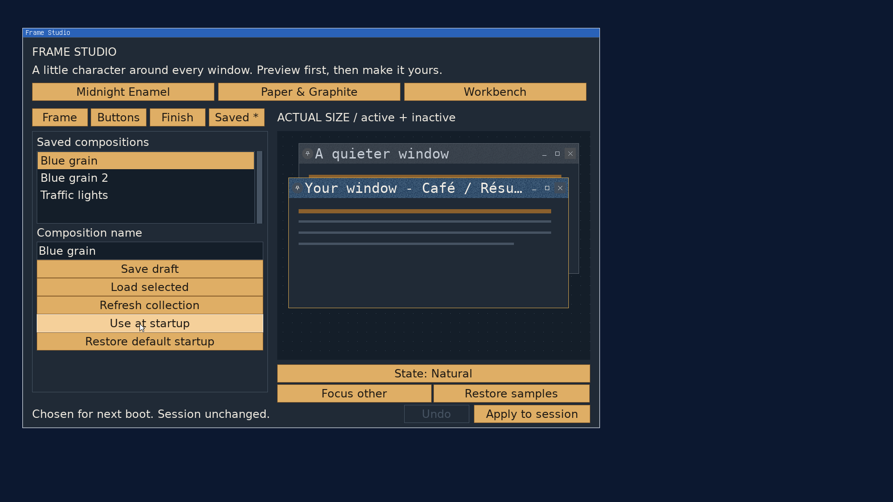

# Frame Studio: startup decoration

2026-09-22, `codex/frame-studio`. **Saved** offers **Use at startup** and
**Restore default startup**. Use at startup is enabled after saving or loading
a composition while its draft is unchanged; an unsaved initial preset is not
eligible. Undo back to the saved baseline restores eligibility. These controls
change the next boot choice without applying to the current session.

The startup snapshot is independent of the named collection entry. It contains
prepared glyphs and finish tiles, so neither the source font nor the collection
file is needed at boot. Collection deletion and independent button-symbol
colors remain separate slices.

## Storage and startup

`libos64/decoration_startup.c` owns the bounded binary persistence and installation
API; the desktop does not depend on Frame Studio's private model/storage code.
The config ladder resolves `decoration.startup`, normally in `/home`. Its
16-byte V1 header contains magic `0x31545344`, version, payload byte count and
an FNV-1a checksum of the file with the checksum field zeroed. A nonempty
payload is a fully validated prepared V4/V5 bundle, capped at 8 MiB. The
checksum detects corruption; it is not an authenticity mechanism.

Restore default startup writes a valid zero-payload snapshot rather than
removing the file: the explicit default masks lower config layers. Both saves
use exclusive staging beside the destination, complete short/interrupted
writes, sync, and REQUIRE_ATOMIC_REPLACE. Refusal removes the owned staging
file and retains the previous choice. No unlink-old replacement fallback is
used. Successful sync/rename acknowledges saving.

The desktop explicitly installs the snapshot before creating its desktop
window and spawning configured applications. This is separate from libui's
per-app initialization. The loader checks generation zero and publishes with
expected generation zero; an intervening Apply wins. Invalid/missing data or
publication refusal leave the live frame intact. The desktop reports startup
outcomes and sends failures through its existing diagnostic logger. An existing
nonzero generation skips loading, including when the desktop is restarted.

## Validation

- Strict userland and full ISO builds passed.
- [Sanitized host checks](startup/host.txt) cover embedded snapshots, unchanged
  session on save/default selection, short I/O, allocation/read/write/sync/rename failure,
  restoration failure, explicit default masking a lower layer, corruption and
  truncation, publication refusal, repeat startup and the generation-zero race.
- [Guest selection log](startup/selection-guest.txt) records successful startup
  saving at generation zero followed by an explicit Apply to generation one.
  The [chosen screenshot](startup/chosen.png) still has the built-in live frame;
  [Apply](startup/applied.png) installs the saved 30px Blue grain decoration.
- Independent host inspection checked the extracted startup file's
  [header, payload size and checksum](startup/format.txt). The original
  font and named collection file were [absent](startup/source-absent.txt)
  before the cold-boot restoration check.
- The [cold-boot frame](startup/reboot.png) restored Blue grain without manual
  Load or Apply. Its [generation](startup/reboot-generation.txt) was one before
  Frame Studio launched; the [application log](startup/reboot-guest.txt) confirms
  that generation on entry. All 1242x45 active titlebar pixels, including the
  embedded lettering, [matched](startup/pixels.txt) the pre-reboot Apply image.
- [Restore default startup](startup/default-chosen.png) left that live frame
  intact and [generation one unchanged](startup/default-selected-generation.txt).
  Host inspection verified a valid 16-byte, zero-payload default snapshot.
- The next cold boot automatically launched Frame Studio with the
  [built-in titlebar](startup/default-boot.png) and
  [generation zero](startup/default-boot-generation.txt), confirming that
  Restore default startup takes effect on boot.
- A deliberately truncated startup file produced the expected
  [desktop diagnostic](startup/corrupt-log.txt); configured Frame Studio still
  [opened with usable built-in chrome](startup/corrupt-boot.png) at
  [generation zero](startup/corrupt-generation.txt).

The saved-data fixture and normal Limine boot settings are restored after
verification; the private QEMU instance is stopped. No P5 or independent review
validation has been performed for this slice. Changes remain uncommitted.
