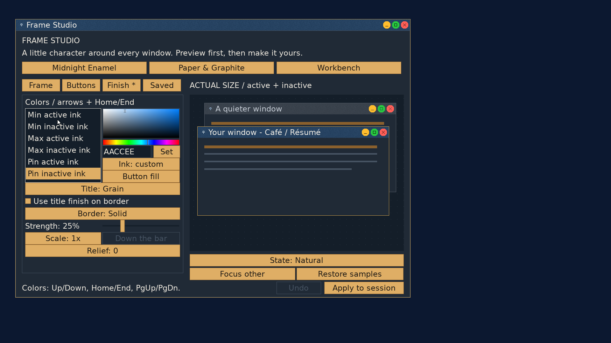

# Frame Studio: independent button-symbol colors

2026-09-23, `codex/frame-studio`, on `userland` base `be2d755`.

Each close, minimize, maximize/restore and pin symbol has independent active
and inactive ink. Zero inherits title text; a chosen color overrides that state.
Finish offers distinct fill and ink entries, the existing picker/hex field,
and an Ink toggle to return to inheritance. The adjacent Button fill shortcut
returns to that control's housing. Short role labels fit the 24px interface.

The prepared V6 header appends 32 bytes to the V4/V5 prefix. Symbol choices are
indexed by action so reordering and temporarily removing a control retains its
colors. Presets reset to inheritance. The loader keeps old saved assets intact
and normalizes their editable recipe; restyling relocates embedded assets behind
the larger header without reopening source fonts. New saves/startup snapshots
carry the complete prepared V6 bundle. The active-composition fingerprint covers
these symbol choices as part of the prepared bytes.

The shared painter selects symbol ink after calculating housing color, keeping
automatic hover housings independent. Custom ink retains its color for hover
and pressed states; pressed keeps its existing one-pixel offset. Unavailable
custom ink blends with the painted pixel beneath the mark, including textured
surfaces under transparent/bare controls. Inherited unavailable ink retains the
old appearance. Hit geometry and window actions are unchanged.

## Verification

- Strict builds and the [ASan/UBSan host suite](symbols/host.txt) passed.
  New cases cover active/inactive per-action colors, automatic/opaque/transparent/
  bare housings, hover/pressed/unavailable states, housing isolation, clipped
  repaint parity, unchanged hits, invalid ink alpha, allocation refusal, and
  V6 save/load. The storage/startup suite includes custom symbol choices.
- Actual 296-byte V4/V5 fixtures match inherited V6 rendering pixel for pixel
  across states. Migration recreates the expected V6 bundle, including its font
  assets, without external sources. Saved active-match tests cover V4/V5/V6.
- QEMU loaded the existing **Traffic lights** V5 file (172968 prepared bytes).
  Through the picker and hex field, set black active and `223344` inactive ink
  for close/minimize/maximize, plus `EEFAFF` active and `AACCEE` inactive pin ink.
  Changed the pin fill to transparent, preserving light title text.
- [Undo](symbols/undo.png) and [inheritance](symbols/inherit.png) restored only
  the close symbol's title-derived ink. [Pixel checks](symbols/pixels-and-storage.txt)
  verified all eight chosen colors and confined the Undo preview difference to
  the active close symbol's 9x9 bounds.
- Saved as **Ink traffic**, selected startup and [applied](symbols/live.png).
  The [log](symbols/edit.txt) records V6's 173000 prepared bytes. Extracted saved
  and startup payloads are byte-identical. [Reopening](symbols/reopen.txt) matched
  the saved composition at generation one.
- Cold boot restored the composition, and Studio [opened its matching saved
  draft](symbols/boot.txt) with no unsaved prompt on closing. Live and preview
  symbol samples match. [Status](symbols/status.txt) remains generation one.
  The final [role labels](symbols/labels.png) and [unavailable preview](symbols/disabled.png)
  were inspected at 1920x1080 with 24px interface text.
- The [real-WM fixture](symbols/kernel.txt) passed V4 and V5 publication, V6
  custom-ink publication, stale-generation refusal, concurrent publishers,
  and geometry-refusal preservation of the live fingerprint.
- Tracked/untracked whitespace checks passed. `tools/stale_refs.sh` reports the
  existing `NO_DECORATIONS` shorthand in GRAPHICS.md and gui.h, referring to the
  live GUI flag; no new superlative claims.

P5 validation remains with the user. This slice requires the updated kernel and
userland followed by a reboot: older kernels refuse V6 bundles. The private QEMU
data and normal boot configuration were restored after verification.
