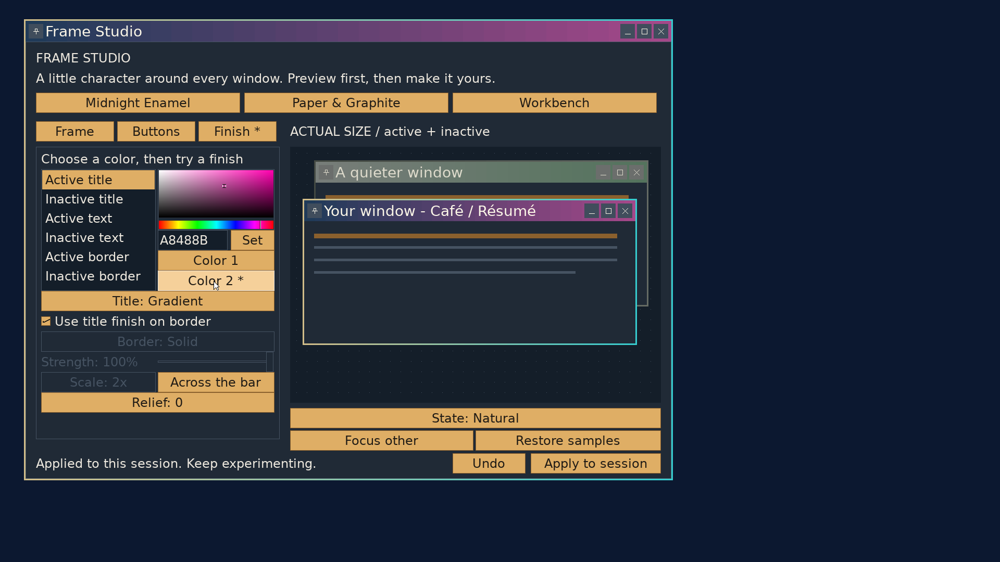

# Frame Studio: two-color finishes

2026-09-22, `codex/frame-studio`. This extends the native editor checkpoint
within the current feature slice.

On **Finish**, select Active title, Inactive title, Active border or Inactive
border, then choose **Color 1** or **Color 2** beside the picker. The selected
color can be changed with the picker or hexadecimal field. Text retains one
color. Solid disables the second selector but keeps its stored value.

Gradients span the two exact endpoints and ignore Strength. Grain varies
between the colors; stripes alternate them; stipple places dots of Color 2
over Color 1. For those patterns, Strength blends the second color toward the
first: zero gives Color 1 alone, and 100% uses the full pair. Strength and
Scale are disabled when neither title nor border uses a pattern. Direction
is enabled when either surface uses a gradient or stripes.

Each active/inactive title and border has its own pair. **Use title finish on
border** shares the finish type, retaining the border's colors. Undo, preview,
session Apply and draft close handling include the new colors. Switching the
selected color is a view action and does not consume Undo history.

The prepared format is version 4 with a 296-byte header, adding four second
colors. Earlier versions are refused. The userland tile generator prepares
the color blends; the shared painter continues sampling opaque tiles.
Presets provide complementary second colors and retain the chosen title font.

## Validation

- Strict kernel, userland and ISO builds passed.
- The [sanitized host suite](two-colors/host.txt) covers exact gradient
  endpoints in both directions, strengths 0/50/100%, independent and matched
  borders, opaque bounded blends, exact stripe/stipple colors at full
  Strength, and equal-color degeneration. Existing split-damage, translation,
  font, allocation-refusal, layout and capture checks also passed. Version 3
  is rejected, and draft equality detects second-color edits.
- QEMU ran at 1920x1080 with 24px interface text and independent 28px titles.
  A gradient from `203B59` to `A8488B` was applied to the editor's actual
  frame. The [pixel check](two-colors/pixels.txt) verified both endpoints,
  [two-color stripes](two-colors/stripes.png), and restoration after Undo.
- [Solid](two-colors/solid.png) disabled Color 2; switching back to Gradient
  [retained it](two-colors/retained.png). Text also disabled Color 2. A
  separate inactive title endpoint `53735C` and active border endpoint
  `33CCD0` [coexisted with the title pair](two-colors/independent.png), with
  the border sharing the title's gradient.
- The [guest log](two-colors/guest.txt) records three successful Apply
  operations and a [zero exit status](two-colors/exit.txt).
- Tracked/new text whitespace checks passed. `tools/stale_refs.sh` reported
  the existing `NO_DECORATIONS` prose shorthand; the corresponding flags
  remain live. Updated code comments and format references were checked.

The private QEMU VM used port 55558 and was stopped after testing. Temporary
1920x1080 GUI boot settings were restored, followed by a normal ISO rebuild.
The helper's missing GUI boot serial marker remains as documented in the
native editor checkpoint. No P5 or independent review validation was done.

This checkpoint predates named saving; [the saving checkpoint](saving-checkpoint.md)
records its implementation. Startup selection and imported textures remain
outside this slice; Apply remains session-only.
