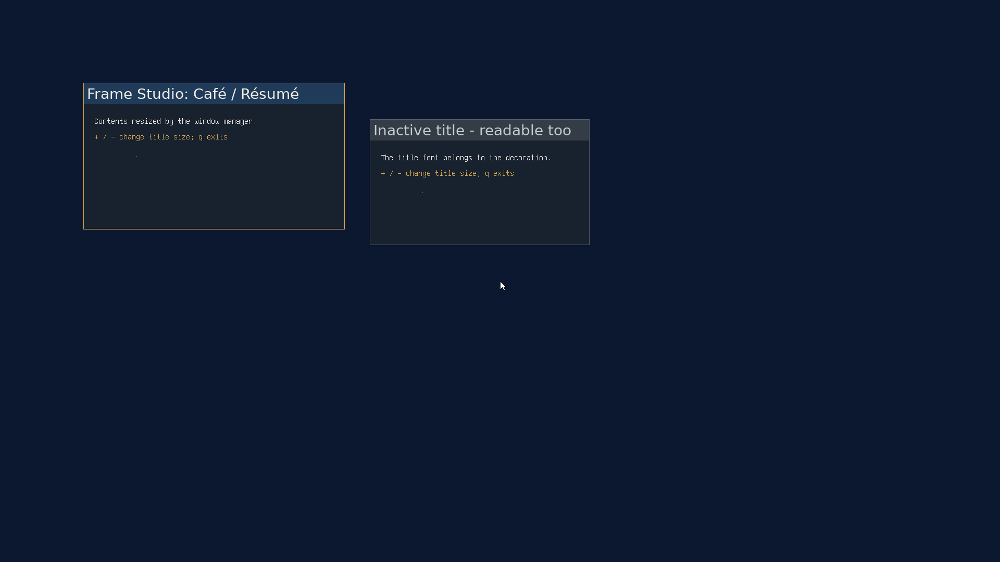

# Frame Studio: typography foundation

2026-09-22, `codex/frame-studio`, based on `4a91d59` (merged userland arena).
This records the first checkpoint; [standard controls](controls-checkpoint.md)
extend it with the version 2 bundle and button interaction.

This checkpoint installs prepared proportional title fonts into the live window
manager. It supplies the shared painter, bounded asset format, userland arena
preparation, generation-checked publication, and geometry conversion needed by
the editor. It does not implement `/bin/framestudio`, Control Center integration,
configurable buttons, textures, saved compositions, or startup restoration.
Boot still uses the bitmap title font until a prepared bundle is applied.

The screenshot is from QEMU after changing the fixture's title size from 24px
to 28px and restoring its maximized window. It is a live integration fixture,
not the Frame Studio editor or a concept mockup.

## Validation

- Strict freestanding kernel and userland builds, plus the complete ISO build:
  `make -C kernel -j8`, `make -C userland -j8 all`, and `make -j8` passed.
- `ASAN_OPTIONS=detect_leaks=0 tools/test_decoration_host.sh` passed bundle
  validation, selected allocation-denial cases, scratch lifetime, clipping,
  full/split-damage equality, and pixel parity with the existing F2 text painter
  using the fake font backend. The test also checks tracked allocations return
  to zero; sanitizer leak detection itself was disabled.
- `ASAN_OPTIONS=detect_leaks=0 python3 tools/test_font_provider_host.py` passed
  1,368,124 provider/adoption checks and 672 allocation-denial points.
- `ASAN_OPTIONS=detect_leaks=0 python3 tools/test_text_host.py` passed 7,161
  checks. The font backend contracts and 17 layout acceptance vectors passed.
- `python3 tools/fonts/generate_w1.py --check` passed after moving the generated
  W1 data into the shared ABI include tree. Kernel painter disassembly was
  checked for SIMD register use; none was found.
- `git diff --check` passed. `tools/stale_refs.sh` reported the shorthand
  `NO_DECORATIONS` in existing prose; the corresponding public flag remains
  live. It does not indicate a retired feature.

## Guest evidence

The private QEMU VM used 1920x1080 and `/tests/decorationtest --hold`. Preparation
loaded `/tests/fonts/DejaVuSans.ttf`, then released its font context before
publishing the finished bundle. The fixture verified:

- ordinary content dimensions, backing pointer, sample pixel and content
  position survive Apply;
- a window created after Apply receives its requested content dimensions;
- stale generations, malformed staging and abandoned staging do not publish;
- two threads racing BEGIN on one descriptor produce one success;
- two independent publishers using one generation produce one success.

The interactive sequence maximized the focused window, fixed its content
minimum (`l`), and requested a larger font (`+`). Apply refused and retained
the old geometry. Releasing the minimum (`r`) allowed the increase. Restore
returned to 500x240 content with a taller frame. The [guest log](guest-typography.txt)
records those dimensions; [exit status](guest-exit.txt) was zero. An earlier
run also exercised hiding/showing the titlebar and maximize/restore.

For this run, temporary `limine.conf` changes selected 1920x1080, a one-second
boot timeout, and `GUI BACKSTOP=10` on the default QEMU ext2 entry. Those changes
were restored after testing. The worktree's tracked `tools/vm*` helpers used
localhost monitor port 55558 and private disk copies. `vmboot` timed out waiting
for its serial boot marker while the GUI and console were operational; guest
results and screenshots establish execution. The VM was stopped after capture.

## Remaining work and review

This code has not had independent architecture or implementation review.
The publication races above are targeted tests, not an exhaustive concurrent
WM stress test. Creation racing Apply, pointer capture cancellation during
Apply, and repeated long-running publication deserve further coverage before
release. Bare-frame popup behavior and ordinary existing applications also
need broader desktop regression testing.

Next stages follow [FRAME_STUDIO.md](../../FRAME_STUDIO.md): button layout and
interaction, the native editor with shared preview, finishes, composition
persistence, and Control Center access. The editor must own its title-font
selection independently and initialize it from the effective interface font.
