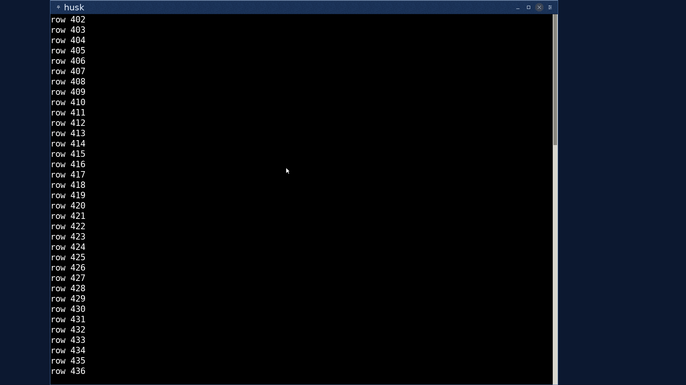
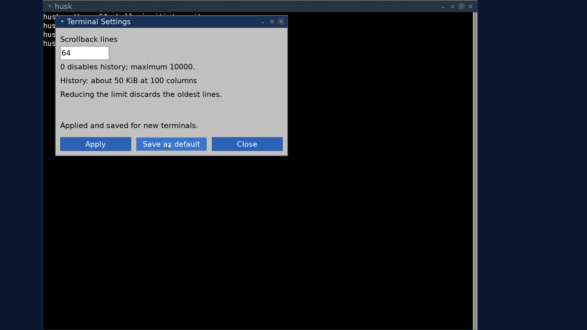
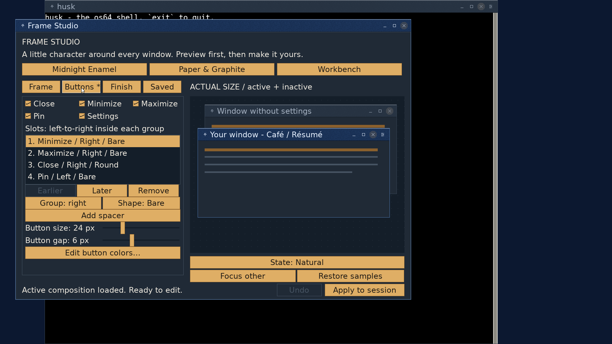

# gterm scrollback and Settings validation

Validated in an isolated worktree stacked on kernel foundation `18cd0944`,
which targets userland `2491041f`. The independent kernel contract and test
receipts are in [TERMINAL_CONTRACTS.md](../../TERMINAL_CONTRACTS.md).
The implementation requires the updated kernel, libos64, gterm and Frame Studio;
install the updated included frames to expose Settings in those compositions.
Existing personal compositions remain readable and Ctrl+Alt+S opens settings.

## Automated checks

- Strict kernel/userland and complete ISO/disk build: `make -j4` passed.
- `tools/test_gterm_fonts_host.py`: 2,406,622 checks, including 4,482 font
  allocation denials; explicit allocator accounting finished at zero live bytes.
  Added history parsing, PS/2 and HID navigation bursts, and accumulation of
  several scroll events before a snapshot, plus distinct quota/memory/contention
  feedback. [Host receipt](font-host.txt).
- `tools/test_ui_text_host.py`: 148 checks passed with the fake font backend,
  including settings root layout, staged font adoption and layout refusal.
- `tools/test_decoration_host.sh`: passed. V4/V5/V6 loading, V7 Settings,
  supported/unsupported layout, hit testing, capture, 16-pixel icon painting and
  custom symbol ink are covered. The six included compositions were regenerated
  and validated with `tools/generate_frame_collection.py --sanitize`.
- Host checks used ASan/UBSan with `ASAN_OPTIONS=detect_leaks=0`: LeakSanitizer
  cannot operate under this environment's process tracing. The font harness's
  own lifetime accounting remains enabled.
- QEMU, 8 cores: the harness reported 31 preboot, 34 postboot and 3 late
  passes, with zero failures. NIC-dependent checks and the secondary ext2 write
  check skipped because this private VM lacks their devices/mount. New PTY tests
  cover ring rollover, geometry epochs, zero retention,
  STREAM refusal, distinct history-quota refusal without changing old cells,
  live-only terminal birth at the full quota, and reclamation.
  [Kernel receipt](kernel-tests.txt).
- Guest `/tests/ptyhistorytest`: 24 checks, zero failures. Burst retention,
  stable anchors, eviction,
  bounded copies, argument refusal, old snapshot ABI, geometry changes,
  zero/grow preservation and concurrent capacity/geometry changes.
  [Guest receipt](pty-history.txt).
- Guest `/tests/gtermfonttest`: 12/28-pixel and bitmap adoption, real PTY resize
  refusal preserving the current font/grid, proportional-font refusal, child
  SIGWINCH and usable input. Its generated `NoBoxes.ttf` must be staged under
  `/tests/fonts/` before running. The fixture was staged for the split verification run. [Guest receipt](font-guest.txt).
- `git diff --check` passed. `tools/stale_refs.sh` reported existing
  `MOUSE_WHEEL.md` references after deleting the completed debt; the linked
  document remains present.
- After guest `sync` and VM shutdown, `e2fsck -fn` passed on extracted copies of
  both the root and home filesystems with exit status zero.

## QEMU interaction checks

The split was rechecked for Settings open, invalid input, zero/grow, save with
comment/key preservation, Shift+Home, wheel navigation, and the font fixture.
The broader interaction checks below were also completed on the original
combined implementation; the user independently accepted scrollback and Settings.

The desktop ran at 1920x1080 with 24-pixel Terminal and Interface fonts.

- Thumb dragging and track paging reached retained output. Shift+Home/End and
  Shift+PageUp/PageDown moved between historical and live screens. The keyboard
  routing fix leaves text-console Shift+PageUp/PageDown with the VT handler.
- Wheel scrolling, ordinary typing and right-click paste returned to the
  expected view. Several wheel events within one GUI frame now accumulate
  against the requested view.
- Selecting an old row copied exactly the seven bytes `row 402` to the clipboard.
- Both the titlebar button and Ctrl+Alt+S opened Terminal Settings. Reopening
  preserved the draft `77`; invalid `10001` stayed available for correction.
- Apply accepted zero retention, a subsequent reopen displayed zero, and growing
  again preserved the live display. The dialog shows the current memory estimate.
- Saving 64 retained an unrelated key and a comment in `/home/gterm.conf`.
  A fresh terminal after restart read the saved default. Applying another value
  without saving remained local to that terminal.
- Frame Studio displayed the Settings checkbox and two correctly filtered
  samples: the second had no Settings glyph or empty slot. The settings dialog
  itself also omitted Settings.

P5 hardware was not exercised. USB navigation is covered by the shared event
mapping tests and matching driver change; the QEMU keyboard interaction used
PS/2. Allocation-budget refusal was tested in the kernel, not by exhausting
physical memory through the dialog. Save-error reporting was inspected in code;
the graphical save test used a writable configuration file.
