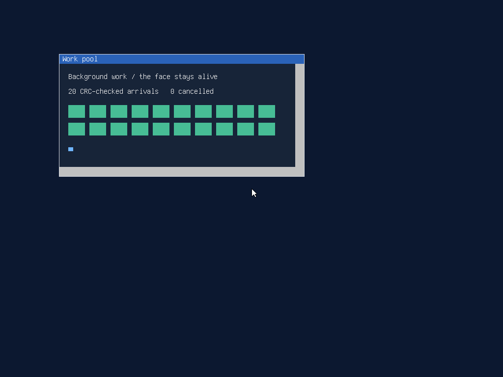

# Work-pool validation

Implementation based on `08fab5fc` (GUI doorbells), tested on 2026-09-25
local time / 2026-09-26 UTC. This is host and QEMU evidence; P5 hardware
validation and implementation review remain separate.

## Build and host tests

- Strict `make -j8`: kernel, shared libraries, applications, fixtures and ISO
  succeeded. Existing raw fixture RWX linker notices remain unrelated.
- `bash tools/test_work_host.sh`: ASan/UBSan/LeakSanitizer passed using real
  pool code over pthreads and host pipes. [Output](host.txt).
- Existing allocator host test: **147 checks, zero failures**. Its printed
  heap complaints are intentional corruption/death cases. [Output](heap.txt).
- `bash tools/test_appearance_host.sh`: sanitizer-backed appearance, session,
  toolkit and doorbell regressions passed after the shared lock refactor.
  [Output](appearance.txt).

The work-pool host cases cover twenty jobs through four workers; completion
order and products; partial pipe/thread creation cleanup; reservations held
through DONE; cancellation before run, during run, while waiting and after
DONE; stale ids; a full 256-slot table; destruction with ten active/queued
jobs; and exact release/reap ownership accounting. Heap and handle counters
return to zero.

Controlled handoffs cover a paused job publication and a byte consumed
before claim, interrupted publication rollback, 1,000 cancel/reuse cycles,
and a claimed older job paused before admission. The notification test
issues 140,000 hints across reserved-but-unwritten and consumed-but-unretired
space credits, checks a timeout without consuming a byte, and injects
interrupted and permanent reads/writes. Another test pauses a worker's space
write until destruction has begun and verifies that both handles remain open
until that writer can finish. These internal-state models complement the
actual scheduled worker cases; they are not kernel scheduling instrumentation.

## Eight-core QEMU guest

Q35, 8 cores, 8 GiB, GUI boot, NVMe root/data disks; e1000 and slirp for
the HTTP cases. The temporary harness uses the workspace's named-pipe QMP
helpers and switches VTs with Ctrl+Alt+F1/F8. GUI boot readiness is matched
on the shell banner because GUI boot does not emit the text-boot completion
marker; interleaved serial output must be tolerated.

`/tests/testrun worktest` reported **1 passed, 0 failed, 0 skipped**.
The fixture checks zero-time pipe polling, a finite deadline, buffered data
despite a zero-time poll, and EOF despite a zero-time poll. It then tests
real threads/pipes, products, cap retention, FIFO, cancellation, table refusal
and teardown, comparing `/proc/self/heap` live bytes before and after.
[Guest report](report.txt).

With `python3 tools/httptestd.py --port 58080` on the host:

```text
/tests/worktest http://10.0.2.2:58080
/tests/worktest http://10.0.2.2:58080 --cancel
```

The first completed **20 CRC-checked bodies**, with **42 painted frames**.
The second completed **19**, cancelled `/slow.txt` after body bytes arrived,
and painted **44 frames**. Both returned the user heap's live-byte count to
its starting value and passed the heap integrity check.
[Full fetch](fetch.txt), [cancellation](cancel.txt).

The four routes are `/hello.txt`, `/gzipped`, `/redirect`, and
`/gzip-chunked`. The first three yield the server's 32-byte HELLO; the last
yields its seeded BIG prefix, 200000 bytes, CRC32 `e26ffa7d`. The cancellation
case substitutes `/slow.txt` for request zero. Five redirects per run add
five connections, so these forty jobs produce fifty HTTP requests, not
forty connections. The initial fixture incorrectly expected HELLO from the
fourth route; correcting that expectation made all per-route CRCs pass.

The [TCP snapshot](tcp.txt) shows 50 opened connections, 26 already reaped
(including a separate refused connection), and 25 remaining detached entries:
24 CLOSED and the cancelled stream in TIME_WAIT. None is an attached active
fetch connection. `/sys/openfiles` snapshots match apart from the identity
of the file receiving the report: [before](handles-before.txt),
[after](handles-after.txt).




## Startup check

`/tests/textspawn` performs six batches of fifty spawn/exit/reap operations
on `/bin/true`; the first is warmup. [Before](spawn-before.txt),
[after](spawn-after.txt). At 100 Hz, measured non-warmup batch ranges were
53–188 ticks before and 43–191 after; medians were 83 and 65 ticks. These
noisy QEMU measurements show overlapping ranges and no observed regression,
not identical cycle costs. The baseline used GUI boot without networking;
the new build retained the HTTP run's slirp device.

The shared library's dependency list is unchanged (`libfreetype.so`), and
`os64_runtime_init` is unchanged. Including `os64/lock.h` adds no constructor
or worker startup; pools create threads only when explicitly requested.

See the [library audit](audit.md) for state and lifetime inspection beyond
the HTTP fixture's runtime coverage. The [public guide](../../WORK.md)
documents the API and its caller obligations.
